# PIRO-AIR

**A high-flow, load-cell-probing toolhead for printed-gantry printers, built to perform without a big price tag.**

 

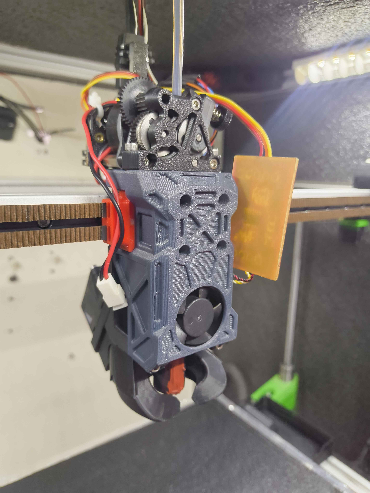

PIRO-AIR is a toolhead designed around components that actually make sense together. Printed-gantry machines are usually paired with whatever toolhead is on hand, and that is often where performance gets left behind. This design picks a Sherpa-pattern extruder, a K2 Plus hotend with its load cell, and a 4028 part-cooling fan, then arranges them so the center of mass sits between the linear rail blocks.

**Status: complete and open for beta testing.** There is no assembly guide or BOM yet, so you will work from the CAD for now (see [Assembly](#assembly)). Feedback is welcome, especially from anyone running a similar printed-gantry setup.

---

## Highlights

- **High flow:** the K2 Plus hotend sustains **32 mm³/s** with normal filament, and has run **PC-CF at up to 350 °C for 24+ hours**.
- **Fast, precise probing:** load-cell probing at **5 mm/s** with **1.4 µm** standard deviation (down from 4.5 µm at 2 mm/s). See [Probing](#probing).
- **Clean input shaper results:** a single dominant resonance peak on both axes, MZV recommended, under 1 % residual vibration. See [Input shaper](#input-shaper).
- **Cooling ducts designed for a 4028 fan:** low back pressure and a direct flow path. In testing you do not need more than about 50–60 % fan speed, even for a speed benchy.
- **Balanced mass:** the extruder motor sits slightly behind the hotend and mounts directly on the linear rail block, keeping a direct-drive filament path.
- **No supports needed** for any printed part.
- **Estimated total cost: about USD 100–150.**

---

## Gallery

| | |
|---|---|
| 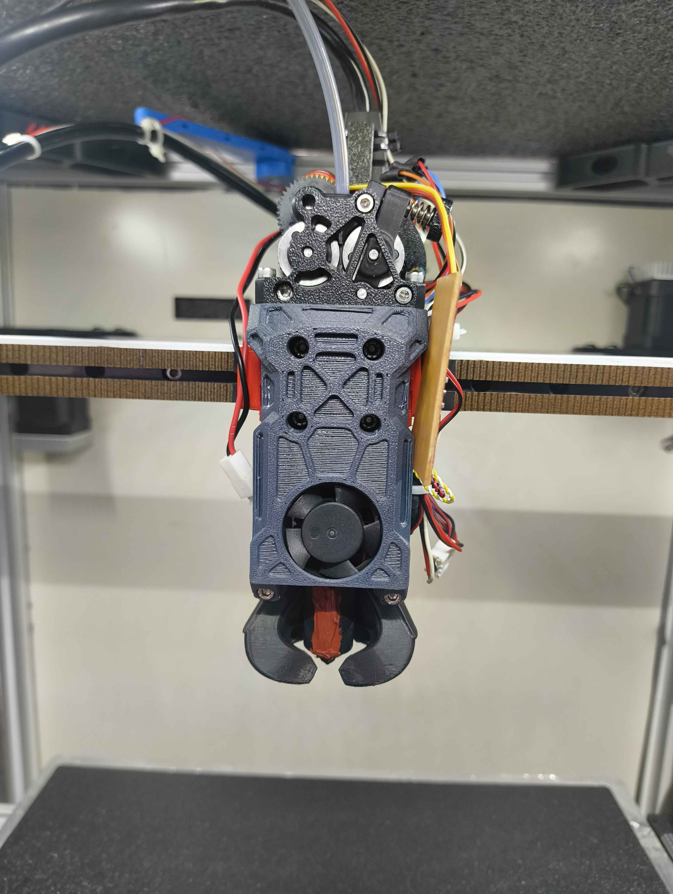 | 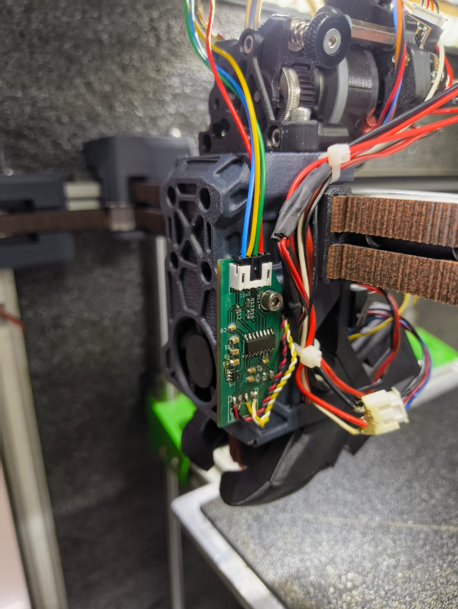 |
| Front view | HX717 load cell amplifier board mounted on the side |
| 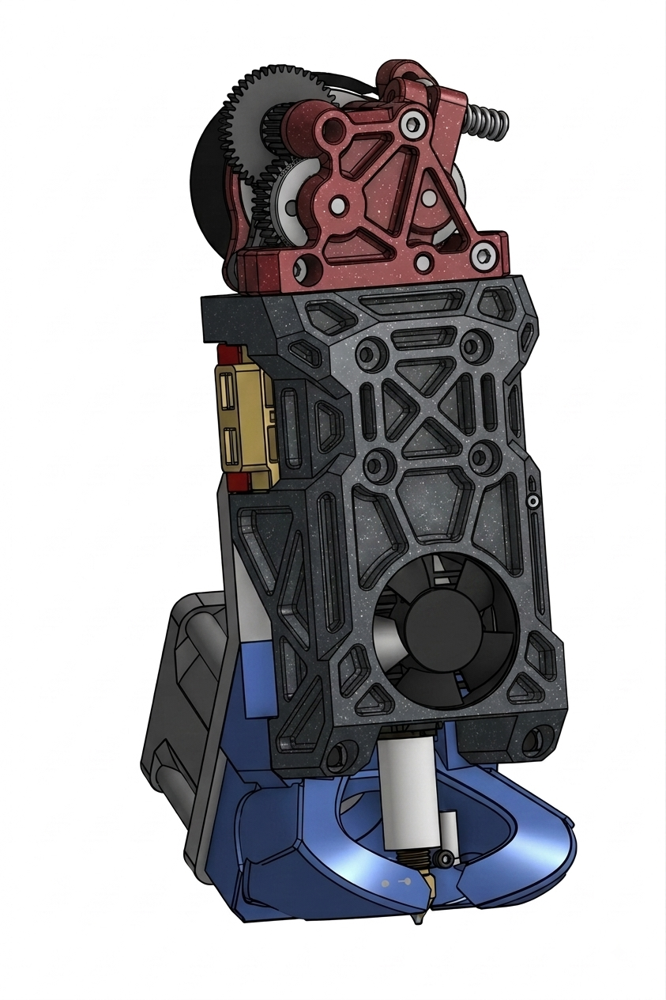 | 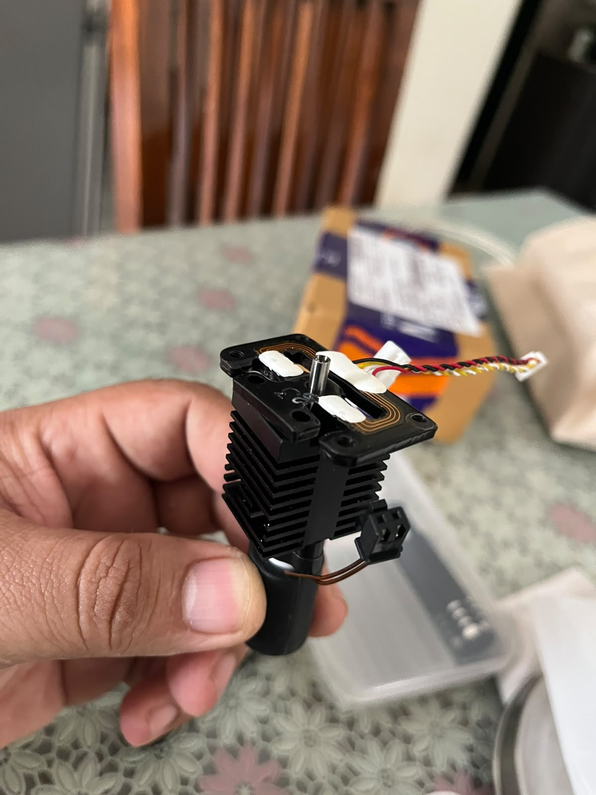 |
| CAD render | K2 Plus hotend and load cell |
| 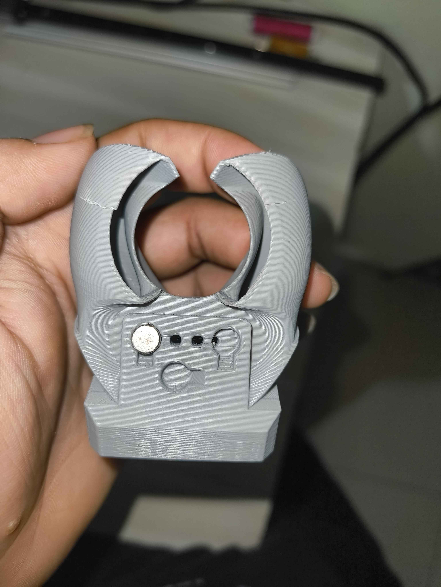 | 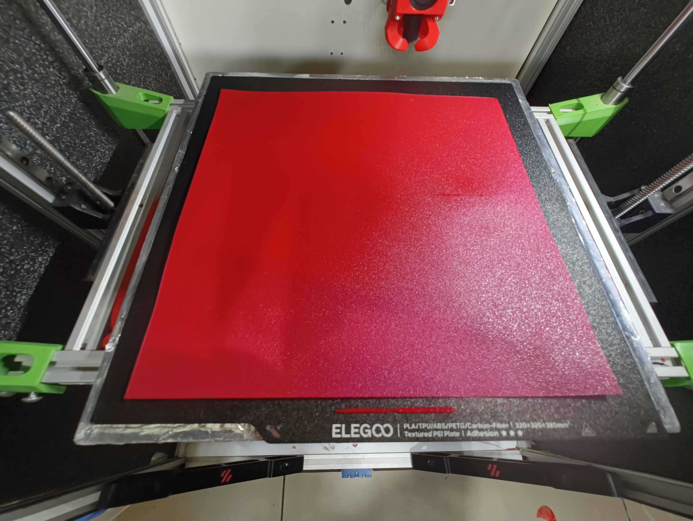 |
| Klicky probe duct variant (magnet mount) | Full-bed print |

<!-- TODO: confirm whether the tan board in toolhead-front.png / toolhead-angle.png is an earlier iteration of the amplifier board mount, and label photos by iteration if they differ. -->

---

## Supported hardware

| Component | Supported now | Planned |
|---|---|---|
| **Hotend** | Creality K2 Plus (original recommended; OEM versions also work and cut cost) | |
| **Extruder** | Any Sherpa Mini-pattern extruder. Main target and COM-optimized: [ProtoXtruder](https://github.com/nhchiu/VoronMods/tree/main/Extruders/ProtoXtruder) | |
| **Probe** | K2 Plus load cell, Klicky probe | Eddy probes: Beacon, Cartographer |
| **Load cell amplifier** | HX717 board (any amplifier supported by Klipper works) | |
| **Part cooling fan** | 4028 | |
| **Hotend cooling fan** | 3010 | |
| **Rail** | MGN12H | |
| **Carriage** | Xol carriage clips | |
| **Printer** | Any printer with the X rail at the front | |

The toolhead has a mounting hole for the load cell amplifier PCB.

---

## Performance

### Hotend

The K2 Plus hotend is a good budget option. With a good 3010 fan and a closed chamber, no heat creep has been seen when printing PLA.

| Test | Result |
|---|---|
| Volumetric flow (OEM hotend, regular ABS and normal filament) | 32 mm³/s, reliable |
| Maximum temperature | 350 °C, tested for 24+ hours printing PC-CF |

<!-- TODO: add nozzle size, hotend temperature and test method for the 32 mm³/s figure. -->

### Cooling

Part cooling uses a single 4028 fan (31 CFM). The ducts are designed to use the fan's full output by reducing back pressure and giving the air a direct path to the nozzle. In testing, fan speed above roughly 50–60 % was not needed, even on a speed benchy.

Hotend cooling uses a 3010 fan.

### Probing

The K2 Plus load cell is read through an HX717 amplifier. Probing speed was raised from 2.0 mm/s to 5.0 mm/s, and accuracy improved rather than degraded.

| Probe speed | Standard deviation |
|---|---|
| 2.0 mm/s (before) | 4.5 µm |
| 5.0 mm/s | 1.4 µm |

A `PROBE_ACCURACY` run at a higher speed, from the Klipper console:

```
PROBE_ACCURACY SAMPLES=10 PROBE_SPEED=10 LIFT_SPEED=2
```

| Setting / result | Value |
|---|---|
| Position | X165 Y165 |
| Samples | 10 |
| Probe speed | 10 mm/s |
| Lift speed | 2 mm/s |
| Range | 0.007187 mm |
| Average | -0.015651 mm |
| Median | -0.016308 mm |
| Standard deviation | 0.002170 mm (2.17 µm) |

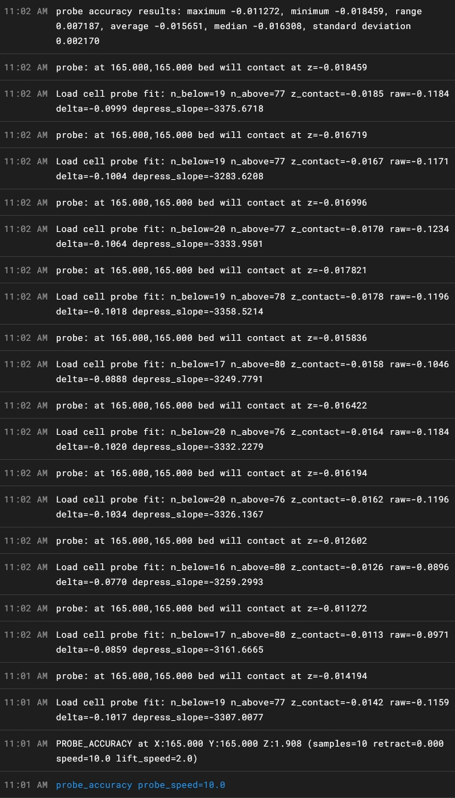

<!-- TODO: confirm which figures to headline. The 1.4 µm at 5 mm/s figure has no log attached; the log above is at 10 mm/s. -->

### Input shaper

Measured with Klippain Shake&Tune v6.0.0 on the author's 400 mm-class printer. Accelerations are lower on this machine because of its size, and a smaller printer should reach higher values. Results are printer-dependent.

| Axis | Resonance | Damping ratio (ζ) | Recommended shaper | Residual vibration | Smoothing | Max accel |
|---|---|---|---|---|---|---|
| X | 57.6 Hz | 0.071 | MZV @ 59.0 Hz | 0.3 % | 0.063 | 10200 mm/s² |
| Y | 40.5 Hz | 0.055 | MZV @ 40.4 Hz | 0.7 % | 0.126 | 4770 mm/s² |

Both axes show one dominant peak and a clean spectrogram. The X axis has a minor second peak at 95 Hz.

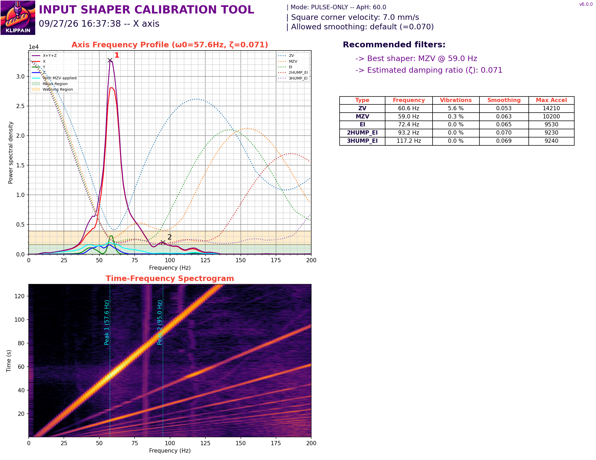
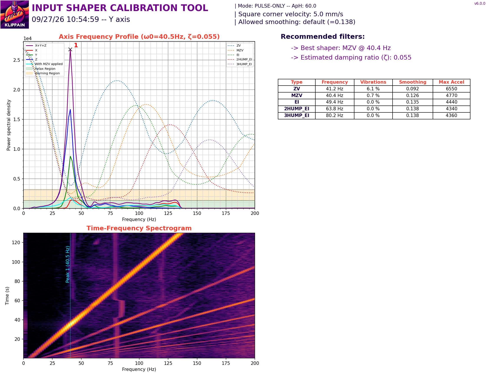

### Center of mass

The components are aligned so that the center of mass sits between the linear rail balls and blocks. The toolhead is balanced before the rest of the layout is locked in. The extruder motor sits behind the hotend and mounts directly on the rail block.

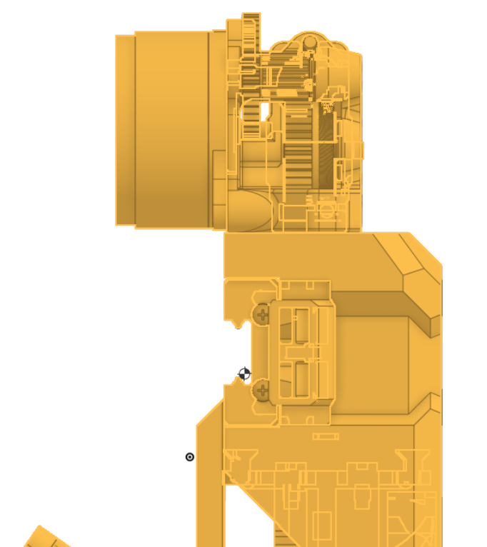

The center of mass analysis is optimized for the ProtoXtruder. Other Sherpa-pattern extruders fit the mount but will shift the balance.

---

## Printing the parts

| Setting | Value |
|---|---|
| Material | ABS or better (ASA, PC, and so on) |
| Nozzle | 0.4 mm or 0.6 mm |
| Walls | 5 |
| Infill | 20 % |
| Supports | None required |

<!-- TODO: add layer height, part orientation, and a file list with one row per printed part and its quantity. -->

---

## Assembly

There is currently no assembly guide or BOM. Use the CAD files in `CAD/` as the reference for now. A BOM and step-by-step guide are on the roadmap.

<!-- TODO: link CAD, STL and STEP folders once uploaded. -->

---

## Electronics and Klipper

- Load cell amplifier: HX717 board, mounted on the toolhead's PCB mounting hole. Any amplifier supported by Klipper can be used.
- Probes: K2 Plus load cell, or Klicky using the magnet-mount duct variant.

<!-- TODO: add wiring table (fan voltages, HX717 connections, probe pins) and a link to a Klipper config file with the extruder, hotend, load cell probe and fan sections. -->

---

## Roadmap

- Eddy probe support (Beacon, Cartographer)
- BOM and assembly guide
- Z thermal adjust with the load cell: Klipper's `z_thermal_adjust` currently does not work because the load cell is used for Z homing, and setting Z0 with it does not register as a switch trigger the way the module expects.

---

## Beta testing

This build is ready for beta testers. Please open an issue with:

- Your printer and gantry type
- Rail size and carriage
- Extruder and hotend used
- Photos of the fit, plus any print quality or probing results

---

## Credits

- **[Xol Toolhead](https://github.com/Armchair-Engineering/Xol-Toolhead)** by Armchair Engineering: the carriage clips used for mounting.
- **[ProtoXtruder](https://github.com/nhchiu/VoronMods/tree/main/Extruders/ProtoXtruder)** by nhchiu: the primary extruder this toolhead is designed around.
- **[Sherpa Mini](https://github.com/Annex-Engineering/Sherpa_Mini-Extruder)** by Annex Engineering: the mounting pattern.
- **Creality**: K2 Plus hotend and load cell.
- **Klippain Shake&Tune**: input shaper analysis.

<!-- TODO: add any other designs, fans or components you want to credit. -->

Designed by [Team ONBOX_Creations/handler Vivek Kailas Varma].

---

## License

Licensed under the [GNU General Public License v3.0](LICENSE).
